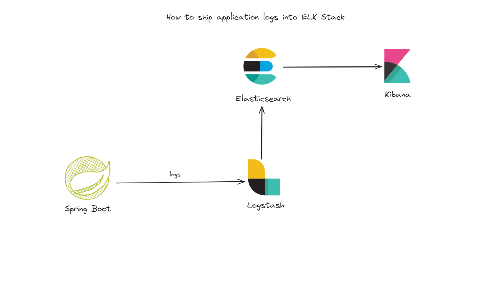

## Centralized Logging with ELK Stack

#### 1) What is ELK Stack ?

ELK stands for elasticsearch, logstash, and kibana. These three technologies have different purposes and use cases:

- ``Logstash``: is a data processing pipeline that dynamically ingests, transforms, and ships your data regardless of format or complexity. In our case, it will get the logs and ships them into Elasticsearch in a format that Elasticsearch can understand.

- ``Elasticsearch``: is a distributed, RESTful search and analytics engine capable of addressing a growing number of use cases. As the heart of Elastic Stack, it centrally stores your data for lightning fast search, fine-tuned relevancy, and powerful analytics that scale with ease. In our case, it will gets data from logstash, and save them in Elasticsearch.

- ``Kibana``: runs data analytics at speed and scale for observability, security and search with Kibana. Kibana gives you the ability to understand your data quickly, spot trends and anomalies at glance, and route findings to the correct team on the spot. In our case, we will be able to visualize the logs that are saved in Elasticsearch by the help of Kibana.

